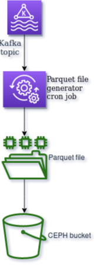
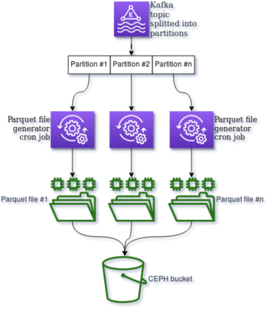
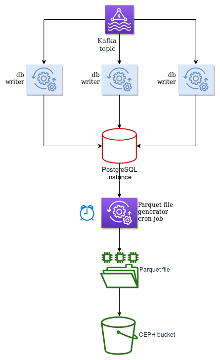
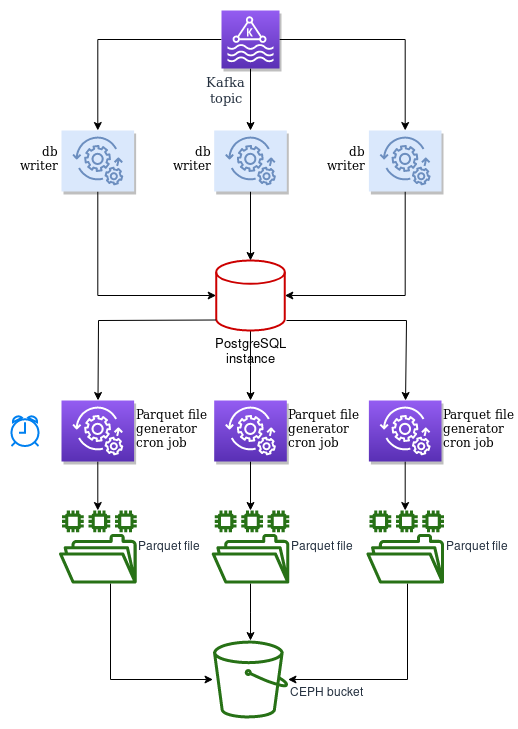
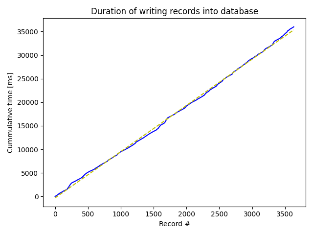
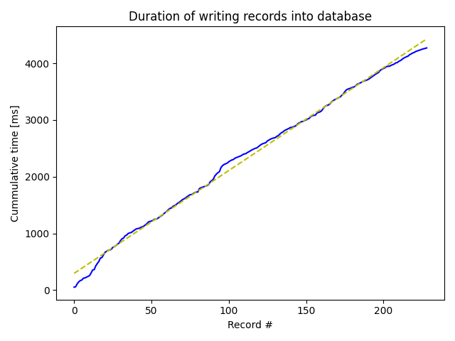

# Description

A proof of concept of Parquet files generator. Data to be used are consumed
from selected Kafka topic and PostgreSQL is used as a cache for such data.

## Architecture

### A classic Kappa architecture utilizing one Kafka partition

### A classic Kappa architecture utilizing multiple Kafka partitions

### PostgreSQL used as a cache, not scaled up

### PostgreSQL used as a cache, scaled up

## Benchmark results

### Cummulative time for one writer to PostgreSQL database

### Cummulative time for 16 writers to PostgreSQL database

